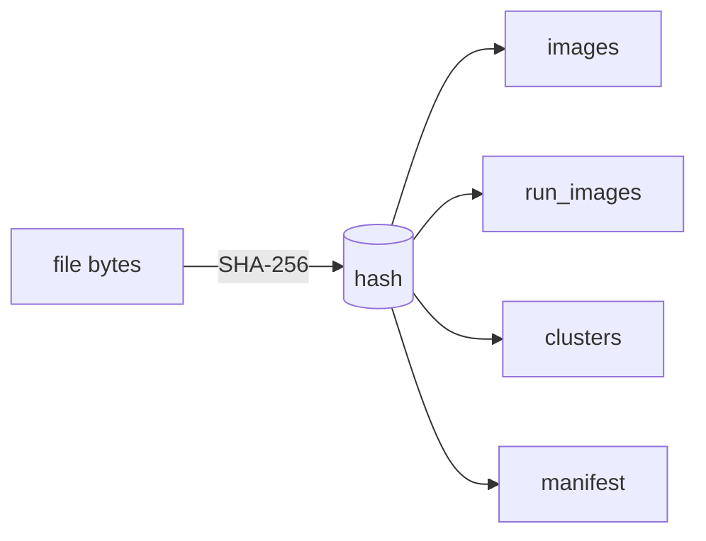

# Content-Hash Idempotency

> Every image is keyed by its SHA-256 content hash, making the whole pipeline a
> deterministic, re-runnable, cross-run cache and keeping in-place runs safe.

## Source

- `backend/app/engine/ingest.py` — computes the SHA-256 on scan
- `backend/app/db.py` — `images.hash` is the primary key across tables
- `backend/app/engine/route.py` — skips reserved buckets + manifested hashes

## How it works

The hash is computed once at scan and becomes the join key for `images`, `run_images`,
`clusters`, and `manifest`. Because results (rating, `media_type`, character/artist IDs,
cached [[CCIP]] features) are stored against the hash, a second run over the same files
reuses prior work instead of recomputing it. Scan also skips reserved output buckets and
already-manifested hashes, so re-running on an output folder doesn't re-sort what it
already sorted — the basis of in-place safety.

## Depends on

- [[Ingest Phase]] — where the hash is produced
- [[Database Schema]] — tables keyed by hash

## Used by

- [[Per-Run Pipeline]] — every phase reads/writes by hash
- [[Dedup Phase]] — exact-SHA collapse is the first dedup tier
- [[Content-Hash Keying Pattern]]

## See also

- [[_index]]
- [[Routing and Commit Flow]]
