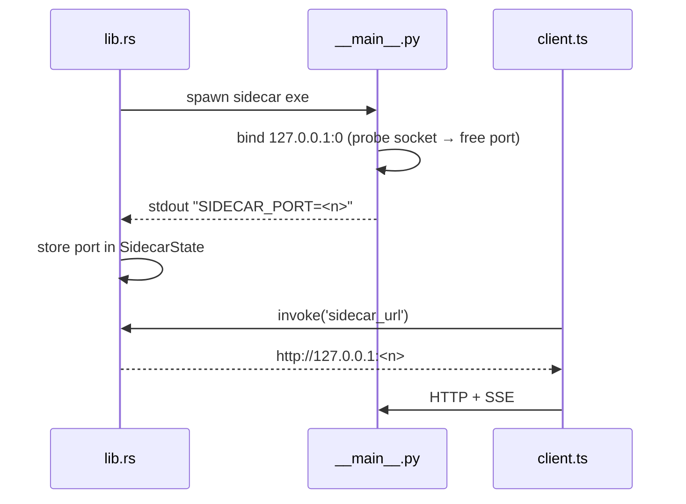

# Dynamic Port Handshake

> The sidecar binds an OS-assigned free port and announces it on stdout; the shell parses
> it and serves it to the WebView — so no port is ever hardcoded.

## Source

- `backend/app/__main__.py` — binds `("127.0.0.1", 0)` via a probe socket, prints `SIDECAR_PORT=`
- `frontend/src-tauri/src/lib.rs` — reads stdout, stores port, `sidecar_url` command
- `frontend/src/api/client.ts` — `resolveBase()` resolution order

## How it works

`client.ts` resolves the base URL in order: injected `window.__SIDECAR_URL__` →
`invoke('sidecar_url')` (Tauri) → the `/api` Vite proxy (dev) → `127.0.0.1:8770`
(fallback). A free port avoids colliding with the author's other localhost apps.

## Depends on

- [[Two-Process Architecture]] — the shell that owns the sidecar
- [[Sidecar Entry Point]] · [[Tauri Shell]]

## Used by

- [[API Client]] — caches the resolved base so URL builders stay synchronous

## Gotchas

- Use the probe-socket bind, **never** the `fd=` socket handoff — it breaks on Windows.
- `bun run tauri:dev`/`build` fail unless the bundled sidecar exe exists (`externalBin` is
  validated at compile time). See [[Tauri Build]].

## See also

- [[_index]]
- [[SSE Progress Flow]] · [[Frontend Dev Workflow]]
