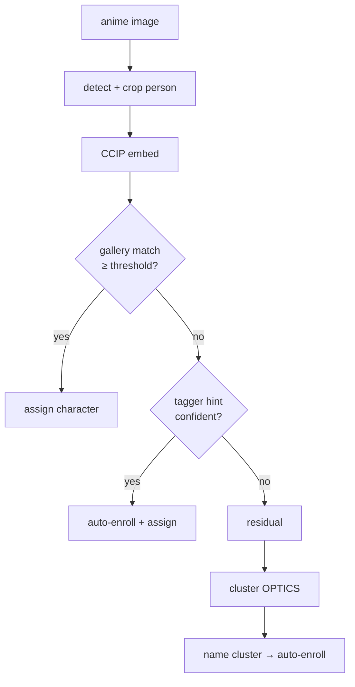

# Identity Resolution Flow

> How an anime image gets a character (or artist) label: detect-crop → CCIP gallery match
> → tagger-hint auto-enroll → residual → cluster.

## Source

- `backend/app/engine/identify.py` — per-facet resolution orchestration
- `backend/app/engine/gallery.py` — best-crop extraction + CCIP prototype match/enroll
- `backend/app/engine/cluster.py` — OPTICS over the residual
- `backend/app/engine/artist.py` — metadata-sidecar artist facet

## How it works

[[CCIP]] features are cached per hash so re-runs and the [[Cluster Phase]] reuse them. The
artist facet is resolved separately and deterministically from gallery-dl JSON sidecars
(Pixiv user, Patreon creator) — see [[Artist Facet]]. Naming a cluster in [[Review Screen]]
enrolls it as a new [[Prototype]], improving the next run.

## Depends on

- [[ML Facade]] — provides CCIP embeddings (or the fallback)
- [[Gallery Prototypes]] · [[CCIP]] · [[Prototype]] · [[Residual]]

## Used by

- [[Routing and Commit Flow]] — `char_names_json` drives destination paths
- [[Review Screen]] — surfaces clusters + borderline matches

## See also

- [[_index]]
- [[Per-Run Pipeline]] · [[Identify Phase]] · [[Cluster Phase]]
