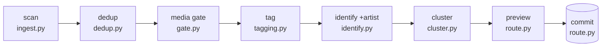

# Per-Run Pipeline

> The ordered chain of phases that turns a scanned folder into a proposed, then committed,
> sorted tree — all keyed by content hash for idempotency.

## Source

- `backend/app/jobs.py` — `run_pipeline` chains phases 2–5 on a worker thread
- `backend/app/engine/*.py` — one module per phase
- `backend/app/server.py` — granular `POST /dedup`, `/gate`, `/tag`, `/identify`, `/cluster`

## How it works

Each phase reads/writes SQLite rows keyed by hash and publishes SSE progress (see
[[Engine-Per-Phase Pattern]]). `jobs.py::run_pipeline` chains dedup→gate→tag→identify→
cluster and emits phase markers; the granular endpoints run the same functions and are
what the tests drive. `scan` runs first via `/scan`; `preview` and `commit` are explicit
read-only and write steps. Cluster only runs when `character` is in the layout.

## Depends on

- [[Content-Hash Idempotency]] — every phase keys on the SHA-256 hash
- [[SSE Progress Flow]] — how phase progress reaches the UI
- [[Pipeline Orchestrator]] — the orchestration entry point

## Used by

- [[Progress Screen]] — visualizes the five worker phases
- [[Routing and Commit Flow]] — consumes the identified rows

## See also

- [[_index]]
- [[Identity Resolution Flow]] · [[01-Backend/engine/_index|engine/ phases]]
