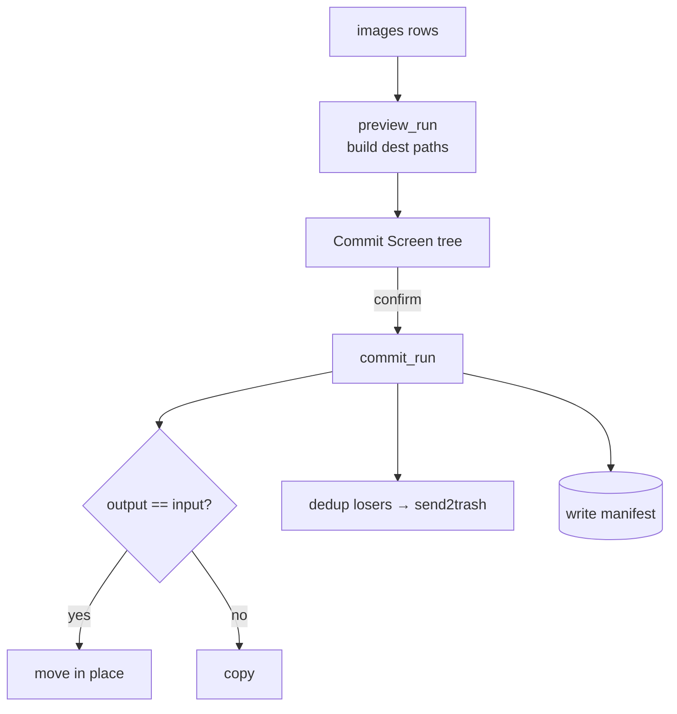

# Routing and Commit Flow

> A read-only preview proposes a destination tree from the SQLite rows; commit then copies
> (or moves) files, trashes dedup losers, and writes the manifest.

## Source

- `backend/app/engine/route.py` — `preview_run` (read-only) + `commit_run` (writes)
- `backend/app/db.py` — `media_type` / `dup_role` / `char_names_json` columns drive paths
- `backend/app/server.py` — `GET /preview` and `POST /commit`

## How it works

Leaf rules: non-anime → `other/`; anime with no character → `anime/`; one character →
`<char>/`; 2+ → alphabetical `A + B + …` (cap 3 + `+N more`, hash-truncate on Windows path
overflow); `nude/` is always the innermost leaf. `GET /preview` touches nothing on disk —
files only move at `/commit`, and dedup losers go to the Recycle Bin via `send2trash`.

## Depends on

- [[Routing and Commit]] — the engine module
- [[Identity Resolution Flow]] — supplies character/artist labels
- [[Dedup Phase]] — flags losers · [[Nude Policy]] — the `nude/` leaf

## Used by

- [[Commit Screen]] — renders the preview and confirms the write

## Gotchas

- Output may equal input → files are *moved* in place rather than copied.

## See also

- [[_index]]
- [[Content-Hash Idempotency]] · [[Per-Run Pipeline]]
