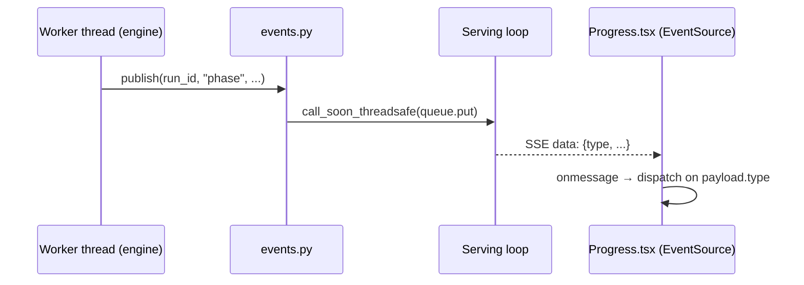

# SSE Progress Flow

> Engine worker threads publish progress events that hop onto the serving event loop and
> stream to a single browser `EventSource` — one handler receives everything.

## Source

- `backend/app/events.py` — per-run pub/sub + `call_soon_threadsafe` marshalling
- `backend/app/jobs.py` — phases call `publish(run_id, "<event>", **data)`
- `frontend/src/api/client.ts` — `events()` EventSource factory
- `frontend/src/pages/Progress.tsx` — single `onmessage` consumer

## How it works

Events are emitted on the **unnamed** SSE channel with the event type carried *inside* the
JSON payload — so the frontend uses a single `EventSource.onmessage` and switches on
`payload.type` rather than registering per-event listeners. See [[SSE Pub-Sub Pattern]].

## Depends on

- [[SSE Event Bus]] — the pub/sub implementation
- [[Pipeline Orchestrator]] — emits the phase markers

## Used by

- [[Progress Screen]] — renders the live stat tiles and advances the stepper

## See also

- [[_index]]
- [[Per-Run Pipeline]] · [[Engine-Per-Phase Pattern]]
