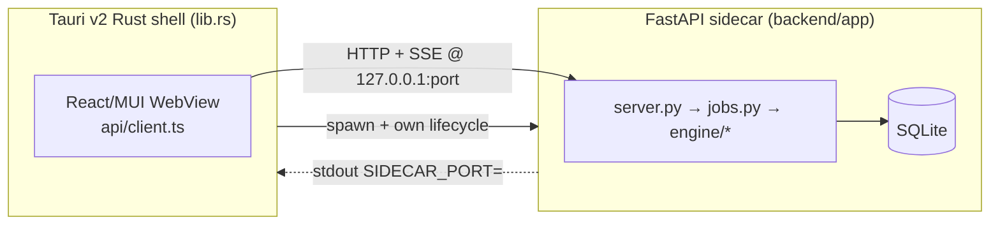

# Two-Process Architecture

> A Tauri v2 Rust shell hosts the React WebView and owns the lifecycle of a Python
> FastAPI sidecar; the two talk only over localhost HTTP + SSE.

## Source

- `frontend/src-tauri/src/lib.rs` — spawns/parses port/exposes `sidecar_url`/kills sidecar
- `backend/app/__main__.py` — free-port bind + handshake print
- `frontend/src/api/client.ts` — base-URL resolution from the WebView side

## How it works

The shell spawns the bundled PyInstaller sidecar in **both** `tauri dev` and `tauri
build` — so the window + sidecar come up as one self-contained command. The sidecar binds
an OS-assigned free port (avoiding collisions with the author's other apps) and the shell
kills it on exit.

## Depends on

- [[Dynamic Port Handshake]] — how the two processes agree on a port
- [[Tauri Shell]] — the Rust lifecycle owner
- [[Sidecar Entry Point]] — the Python side of the handshake

## Used by

- [[API Client]] — resolves the base URL to reach the sidecar
- Every [[Per-Run Pipeline]] interaction

## Gotchas

- Pure browser dev skips the shell: run the sidecar from source on a fixed port and use
  the Vite `/api` proxy. See [[Frontend Dev Workflow]].

## See also

- [[_index]]
- [[SSE Progress Flow]] · [[Tauri Config]]
