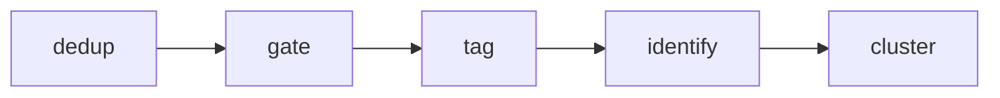

# Pipeline Orchestrator

> Chains the engine phases for a run on a background worker thread, emitting SSE phase markers.

## Source

- `backend/app/jobs.py` — primary implementation

## How it works

`run_pipeline(run_id, layout)` sets the run `status='processing'`, then runs the `PHASES` tuple `("dedup","gate","tag","identify","cluster")` in order, each as a direct call into its engine module ([[Engine-Per-Phase Pattern]]). Before each step it `publish()`es a `"phase"` event with the phase name so `Progress.tsx` can advance. The `cluster` phase only runs when `"character"` is in `layout`.

On success it stores `stats_json`, sets `status='review'`, and publishes `pipeline_done`. Any exception flips `status='error'` and publishes `pipeline_error` (message + traceback, surfaced to the UI and Sentry). A `finally` block always stamps `finished_at`. The same engine functions are reachable via the granular endpoints in [[FastAPI Server]] — those are what the tests drive.

## Depends on

- [[Dedup Phase]] · [[Media Gate Phase]] · [[Tagging Phase]] · [[Identify Phase]] · [[Cluster Phase]] — the chained phases
- [[SSE Event Bus]] — `publish` phase markers
- [[SQLite Repository]] — run status + stats

## Used by

- [[FastAPI Server]] — `POST /process` schedules it

## See also

- [[01-Backend/app/_index|app/ modules]]
- [[Per-Run Pipeline]]
- [[SSE Progress Flow]]
