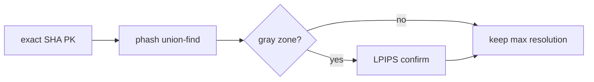

# Dedup Phase

> Group near-duplicate images and keep only the highest-resolution copy, flagging the losers for the Recycle Bin.

## Source

- `backend/app/engine/dedup.py` — primary implementation

## How it works

`dedup_run` probes each run image for an `imagehash.phash`, animated flag, format, and file size. A union-find groups images whose phash Hamming distance is `≤ dup_distance`; pairs in the gray zone (`distance + 6`) are confirmed with an LPIPS pass via [[ML Facade]]. Animated and still images are never matched against each other.

Per group the winner is `max` by `_winner_key`: resolution (`width*height`) → lossless > lossy → file size → newest mtime. The winner gets `dup_role='keep'`, losers `dup_role='trashed'`; singletons are `unique`. Nothing is deleted here — trashing happens at commit.

## Depends on

- [[ML Facade]] — `lpips_difference` confirmer
- [[Settings Config]] — `dup_distance`, `dup_lpips_max`

## Used by

- [[Pipeline Orchestrator]]
- [[Routing and Commit]] — `trashed` losers sent to Recycle Bin at commit

## See also

- [[_index]]
- [[Per-Run Pipeline]]
- [[Content-Hash Idempotency]]
